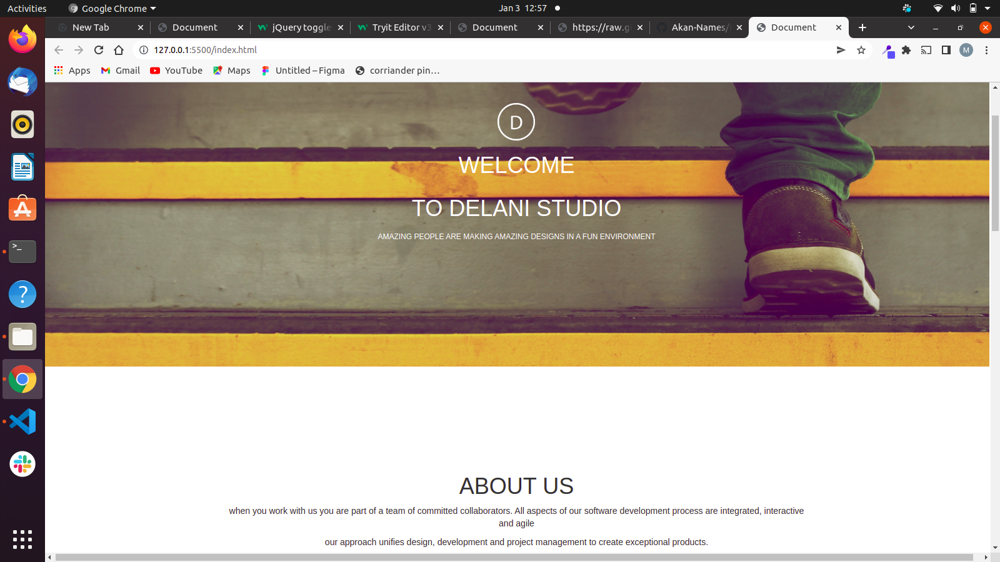

# Delani

## Author

[Melonie Langat](https://github.com/Mel-001)

## Description
Delani Studio is a project that was made to practice Bootstrap and JQuery learnt during the last course. Languages used are HTML and CSS incorporating the frameworks mentioned.


## Screenshot


## Live Page
https://mel-001.github.io/Delani-Studio/


## Installation / Setup instruction
* Open Terminal {Ctrl+Alt+T}

* git clone ```https://github.com/Mel-001/Delani-Studio.git```

* cd Delani-Studio

* code . or atom . depending on the text editor of your choise.

## Technologies Used

* [HTML5](https://github.com/topics/html5)
* [CSS](https://github.com/topics/css3)
* [Bootstrap](https://github.com/topics/bootstrap)
* [jQuery](https://github.com/topics/javascript)
* markdown


## BDD
| Behaviour      | Input        | Output       |
| :------------- | :----------: | -----------: |
|  Enter your name  |   Melonie Langat |     |
| Enter your Email Address  | melonielangat@gmail.com |   |
| Enter your message or comment   |  I would love to work with you     |     |
| Press Submit|     |Pop up "Hello Melonie Langat , we have received your message. Thank you for reaching out to us.|

## Known Bugs
* The site is not responsive enough for some devices. 
* mail chimp API does not function properly.

## Contact Information 

If you have any question or contributions, please email me at [melonielangat@gmail.com]

## License
* *MIT License:*
* Copyright (c) 2021 **Melonie Langat**